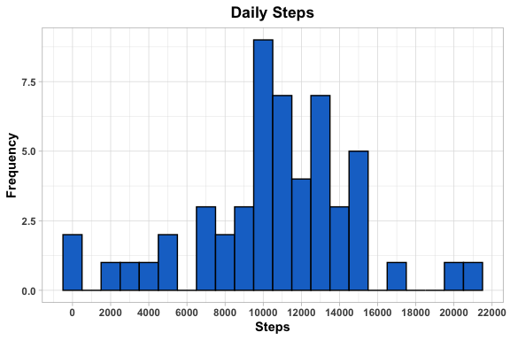
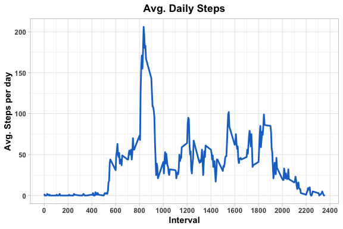
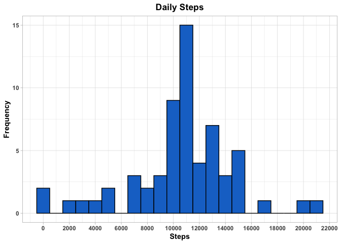
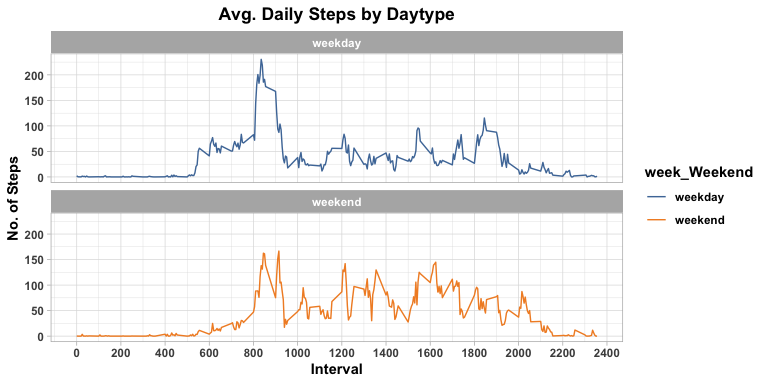

## Loading and preprocessing the data

```r
require(data.table)
```

```
## Loading required package: data.table
```

```r
activityDT <- fread("activity.csv")
activityDT$date <- as.Date(activityDT$date)
print(head(activityDT))
```

```
##    steps       date interval
## 1:    NA 2012-10-01        0
## 2:    NA 2012-10-01        5
## 3:    NA 2012-10-01       10
## 4:    NA 2012-10-01       15
## 5:    NA 2012-10-01       20
## 6:    NA 2012-10-01       25
```

```r
print(summary(activityDT))
```

```
##      steps             date               interval     
##  Min.   :  0.00   Min.   :2012-10-01   Min.   :   0.0  
##  1st Qu.:  0.00   1st Qu.:2012-10-16   1st Qu.: 588.8  
##  Median :  0.00   Median :2012-10-31   Median :1177.5  
##  Mean   : 37.38   Mean   :2012-10-31   Mean   :1177.5  
##  3rd Qu.: 12.00   3rd Qu.:2012-11-15   3rd Qu.:1766.2  
##  Max.   :806.00   Max.   :2012-11-30   Max.   :2355.0  
##  NA's   :2304
```

## What is mean total number of steps taken per day?

**1. Calculate the total number of steps taken per day**

```r
require(tidyverse)
```

```
## Loading required package: tidyverse
```

```
## ── Attaching packages ──────────────────────────────────────────────────── tidyverse 1.3.0 ──
```

```
## ✓ tibble  3.0.1     ✓ dplyr   1.0.0
## ✓ tidyr   1.1.0     ✓ stringr 1.4.0
## ✓ readr   1.3.1     ✓ forcats 0.5.0
## ✓ purrr   0.3.4
```

```
## ── Conflicts ─────────────────────────────────────────────────────── tidyverse_conflicts() ──
## x dplyr::between()   masks data.table::between()
## x dplyr::filter()    masks stats::filter()
## x dplyr::first()     masks data.table::first()
## x dplyr::lag()       masks stats::lag()
## x dplyr::last()      masks data.table::last()
## x purrr::transpose() masks data.table::transpose()
```

```r
totalSteps <- activityDT %>%
    group_by(date) %>%
    summarise(Steps = sum(steps))
```

```
## `summarise()` ungrouping output (override with `.groups` argument)
```

```r
totalSteps %>% head(5)
```

```
## # A tibble: 5 x 2
##   date       Steps
##   <date>     <int>
## 1 2012-10-01    NA
## 2 2012-10-02   126
## 3 2012-10-03 11352
## 4 2012-10-04 12116
## 5 2012-10-05 13294
```

**2. If you do not understand the difference between a histogram and a barplot, research the difference between them. Make a histogram of the total number of steps taken each day.** 


```r
ggplot(totalSteps, aes(x = Steps)) +
    geom_histogram(fill = "dodgerblue3", binwidth = 1000, colour = "black") +
    labs(x = "Steps", y = "Frequency") +
    scale_x_continuous(breaks = scales::pretty_breaks(n = 10)) +
    ggtitle("Daily Steps") +
    theme_light() +
    theme(text = element_text(face = "bold"),
          plot.title = element_text(hjust = 0.5))
```

```
## Warning: Removed 8 rows containing non-finite values (stat_bin).
```

<!-- -->

**3. Calculate and report the mean and median of the total number of steps taken per day**

<!---
**Mean** of total number of steps taken per day = 1.0766189\times 10^{4} 

**Median** of total number of steps taken per day = 10765
-->


```r
Mean <- mean(totalSteps$Steps, na.rm = TRUE)
Median <- median(totalSteps$Steps, na.rm = TRUE)

cbind(Mean, Median)[1,]
```

```
##     Mean   Median 
## 10766.19 10765.00
```


## What is the average daily activity pattern?

**1. Make a time series plot (i.e. 𝚝𝚢𝚙𝚎 = "𝚕") of the 5-minute interval (x-axis) and the average number of steps taken, averaged across all days (y-axis)**


```r
avgSteps_Interval <- activityDT %>%
    group_by(interval) %>%
    summarise(Steps = mean(steps, na.rm = TRUE)) %>%
    round()
```

```
## `summarise()` ungrouping output (override with `.groups` argument)
```

```r
avgSteps_Interval %>% head(5)
```

```
## # A tibble: 5 x 2
##   interval Steps
##      <dbl> <dbl>
## 1        0     2
## 2        5     0
## 3       10     0
## 4       15     0
## 5       20     0
```

```r
ggplot(avgSteps_Interval, aes(x = interval , y = Steps)) + 
    geom_line(colour="dodgerblue3", size = 1) + 
    scale_x_continuous(breaks = scales::pretty_breaks(n = 10)) +
    labs(x = "Interval", y = "Avg. Steps per day") +
    ggtitle("Avg. Daily Steps") +
    theme_light() +
    theme(text = element_text(face = "bold"),
          plot.title = element_text(hjust = 0.5))
```

<!-- -->

**2. Which 5-minute interval, on average across all the days in the dataset, contains the maximum number of steps?**


```r
avgSteps_Interval$interval[avgSteps_Interval$Steps == max(avgSteps_Interval$Steps)]
```

```
## [1] 835
```


## Imputing missing values

**1. Calculate and report the total number of missing values in the dataset (i.e. the total number of rows with 𝙽𝙰s)**


```r
activityDT %>%
    select(steps) %>%
    is.na() %>%
    sum()
```

```
## [1] 2304
```

**2. Devise a strategy for filling in all of the missing values in the dataset. The strategy does not need to be sophisticated. For example, you could use the mean/median for that day, or the mean for that 5-minute interval, etc.**


```r
# Filling in missing values with mean for that 5-minute interval. 
activityDT$steps[which(is.na(activityDT$steps))] <- 
    avgSteps_Interval$Steps[match(activityDT$interval[which(is.na(activityDT$steps))], 
                                  avgSteps_Interval$interval)]
```


**3. Create a new dataset that is equal to the original dataset but with the missing data filled in.**


```r
fwrite(activityDT, "tidyData.csv", quote = FALSE)
```


**4. Make a histogram of the total number of steps taken each day and calculate and report the mean and median total number of steps taken per day. Do these values differ from the estimates from the first part of the assignment? What is the impact of imputing missing data on the estimates of the total daily number of steps?**


```r
# total number of steps taken per day
totalSteps_Impt <- activityDT %>%
    group_by(date) %>%
    summarise(Steps = sum(steps))
```

```
## `summarise()` ungrouping output (override with `.groups` argument)
```

```r
totalSteps_Impt %>% head(5)
```

```
## # A tibble: 5 x 2
##   date       Steps
##   <date>     <dbl>
## 1 2012-10-01 10762
## 2 2012-10-02   126
## 3 2012-10-03 11352
## 4 2012-10-04 12116
## 5 2012-10-05 13294
```

```r
# mean and median total number of steps taken per day
Mean_Impt <- mean(totalSteps_Impt$Steps, na.rm = TRUE)
Median_Impt <- median(totalSteps_Impt$Steps, na.rm = TRUE)

cbind(Mean_Impt, Median_Impt)[1,]
```

```
##   Mean_Impt Median_Impt 
##    10765.64    10762.00
```

```r
ggplot(totalSteps_Impt, aes(x = Steps)) +
    geom_histogram(fill = "dodgerblue3", binwidth = 1000, colour = "black") +
    scale_x_continuous(breaks = scales::pretty_breaks(n = 10)) +
    labs(x = "Steps", y = "Frequency") +
    ggtitle("Daily Steps") +
    theme_light() +
    theme(text = element_text(face = "bold"),
          plot.title = element_text(hjust = 0.5))
```

<!-- -->

Type of Estimate | Mean_Steps | Median_Steps
--- | --- | ---
First Part (with na) | 10766.2 | 10765
Second Part (filled na with mean of 5 min interval) | 107665.6 | 10762


## Are there differences in activity patterns between weekdays and weekends?

**1. Create a new factor variable in the dataset with two levels – “weekday” and “weekend” indicating whether a given date is a weekday or weekend day.**


```r
activityDT$date <- as.POSIXct(activityDT$date, format = "%Y-%m-%d")
activityDT$dayOfWeek <- weekdays(activityDT$date)
activityDT$week_Weekend <- NA
activityDT$week_Weekend[grep("Saturday|Sunday", activityDT$dayOfWeek)] <- "weekend"
activityDT$week_Weekend[-grep("Saturday|Sunday", activityDT$dayOfWeek)] <- "weekday"
activityDT$week_Weekend <- as.factor(activityDT$week_Weekend)
head(activityDT, 10)
```

```
##     steps                date interval dayOfWeek week_Weekend
##  1:     2 2012-10-01 05:30:00        0    Monday      weekday
##  2:     0 2012-10-01 05:30:00        5    Monday      weekday
##  3:     0 2012-10-01 05:30:00       10    Monday      weekday
##  4:     0 2012-10-01 05:30:00       15    Monday      weekday
##  5:     0 2012-10-01 05:30:00       20    Monday      weekday
##  6:     2 2012-10-01 05:30:00       25    Monday      weekday
##  7:     1 2012-10-01 05:30:00       30    Monday      weekday
##  8:     1 2012-10-01 05:30:00       35    Monday      weekday
##  9:     0 2012-10-01 05:30:00       40    Monday      weekday
## 10:     1 2012-10-01 05:30:00       45    Monday      weekday
```

**2. Make a panel plot containing a time series plot (i.e. 𝚝𝚢𝚙𝚎 = "𝚕") of the 5-minute interval (x-axis) and the average number of steps taken, averaged across all weekday days or weekend days (y-axis). See the README file in the GitHub repository to see an example of what this plot should look like using simulated data.**


```r
require(ggthemes)
```

```
## Loading required package: ggthemes
```

```r
IntervalDT <- activityDT %>%
    group_by(interval, week_Weekend) %>%
    summarise(steps = mean(steps))
```

```
## `summarise()` regrouping output by 'interval' (override with `.groups` argument)
```

```r
ggplot(IntervalDT , aes(x = interval , y = steps, color=week_Weekend)) + 
    geom_line() + 
    facet_wrap(~week_Weekend, ncol = 1, nrow = 2) +
    scale_x_continuous(breaks = scales::pretty_breaks(n = 10)) +
    scale_colour_tableau() +
    labs(x = "Interval", y = "No. of Steps") +
    ggtitle("Avg. Daily Steps by Daytype") +
    theme_light() +
    theme(text = element_text(face = "bold"),
          plot.title = element_text(hjust = 0.5))
```

<!-- -->

